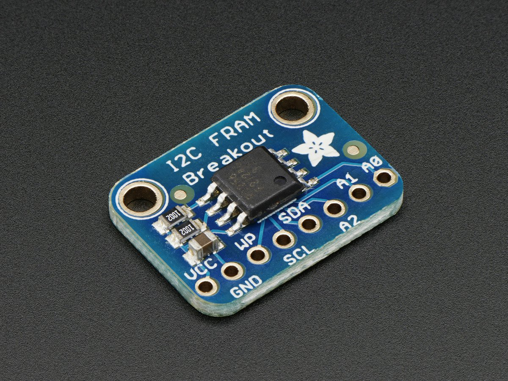

# Adafruit I2C EEPROM & FRAM Library

This is a library for our Adafruit I2C EEPROM & FRAM breakouts.

## About this Driver ##

These modules use I2C to communicate, 2 pins are required to  
interface

Adafruit invests time and resources providing this open source code, 
please support Adafruit and open-source hardware by purchasing 
products from Adafruit!

Written by Kevin (KTOWN) Townsend for Adafruit Industries.
BSD license, check license.txt for more information
All text above must be included in any redistribution

To download. click the ZIP button in the top bar, and check this tutorial
for instructions on how to install: 
http://learn.adafruit.com/adafruit-all-about-arduino-libraries-install-use
